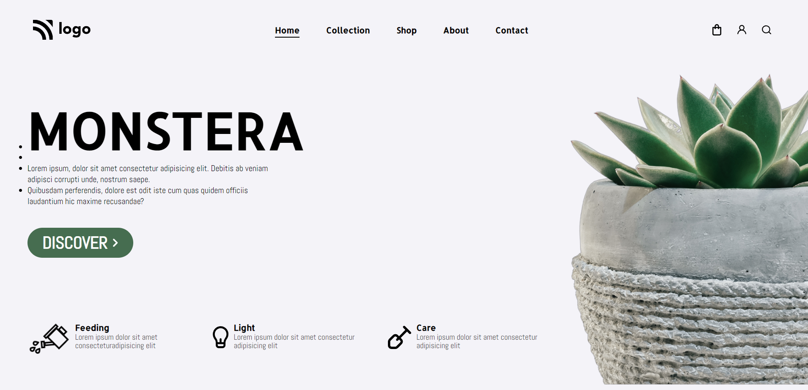

# project-06 #
[project-live](https://fswd-project6.netlify.app)
   - - - -
 # Technology used in this project #
    

  - - - - 
* Skill Gained in this project
  * Learned to target elments using _#id__
  *  Leaned to  change the  image size using __height, width__
  * Learned to create button using __padding__  and __border radius__
  
   - - - -
 ## Time taken to complete this project ##
 * 3 hrs  to completed this poject
 
 ## Screenshot ##
 
 